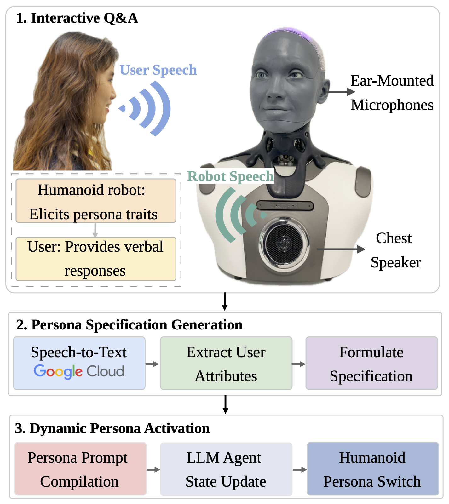

# PACE

**Persona Adaptation through Conversational Elicitation in Human-Robot Interaction**

PACE is a framework for dynamically generating and deploying personalized robot personas through short conversational elicitation. Instead of relying on a fixed, developer-written system prompt, PACE allows a humanoid robot to ask open-ended questions, infer psychologically grounded persona attributes, compile them into a structured `PersonaSpec`, and activate the resulting persona in embodied interaction.

This repository accompanies the paper:

> **PACE: Persona Adaptation through Conversational Elicitation in Human-Robot Interaction**

Project page / video demo: https://anonymous.4open.science/w/PACE-CF28/

---

## Overview

PACE consists of three main stages:

1. **Interactive Q&A Persona Elicitation**  
   The robot asks a small set of open-ended anchor questions and generates adaptive follow-up questions when more detail is needed.

2. **Persona Specification Generation**  
   The elicitation transcript is converted into a structured `PersonaSpec` containing psychological and behavioral dimensions such as traits, values, motivation, regulatory orientation, identity claims, and situational policies.

3. **Dynamic Persona Activation**  
   The structured persona is compiled into a system prompt and deployed on the robot. The robot’s verbal responses and facial expressions are conditioned on the generated persona.

---

## Key Features

- Short conversational persona elicitation instead of long psychometric surveys
- Structured persona representation through `PersonaSpec`
- Multi-perspective analysis over traits, values, motivation, orientation, identity, and policies
- Dynamic persona prompt compilation
- Embodied deployment on the Ameca humanoid robot
- Speech output through Amazon Polly
- Persona specification generation using GPT-5.5-mini
- Facial expression selection from seven basic emotion categories
- Context-aware emotion inference for synchronized speech and facial animation

---

## System Architecture

PACE follows an end-to-end pipeline that converts natural user speech into a dynamically activated embodied robot persona.

  

The pipeline consists of three main stages:

1. **Interactive Q&A**: the humanoid robot elicits persona-relevant traits through open-ended anchor questions and adaptive follow-ups.
2. **Persona Specification Generation**: user responses are transcribed and converted into a structured `PersonaSpec` containing traits, values, motivation, orientation, identity, and situational policies.
3. **Dynamic Persona Activation**: the generated `PersonaSpec` is compiled into a persona prompt, injected into the LLM agent state, and expressed through robot speech and synchronized facial animation.