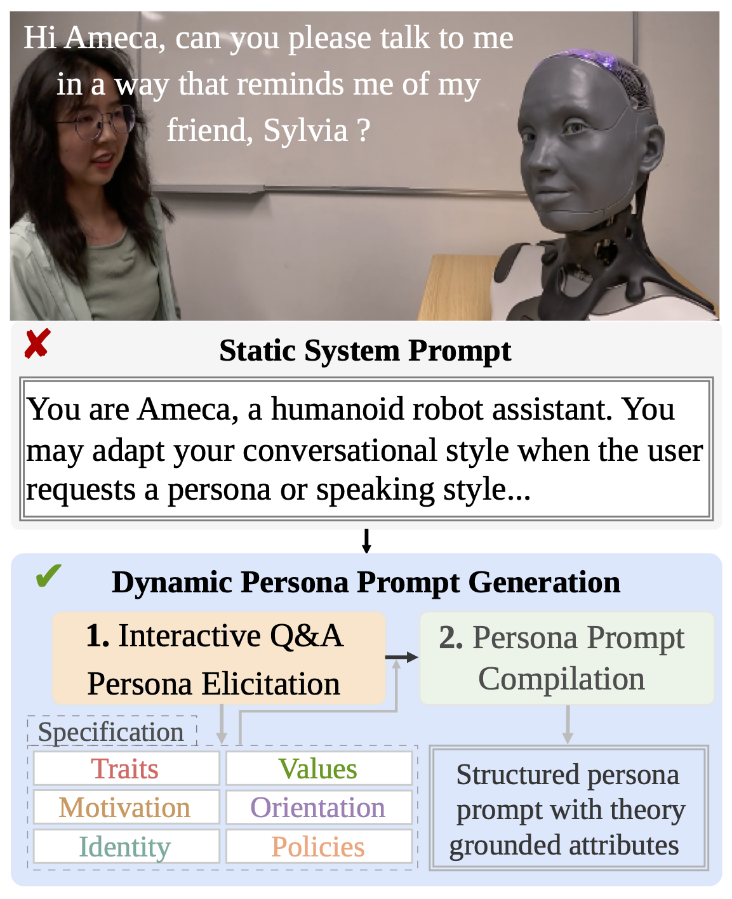
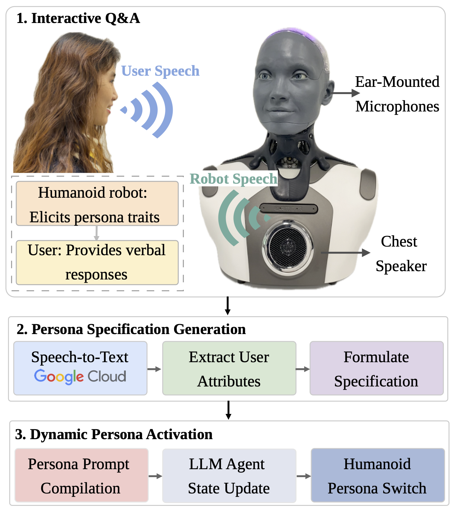

<div align="center">

<h1>PACE: Persona Adaptation through Conversational Elicitation in Human-Robot Interaction 🤖</h1>

<div>
    <a href="https://lipzh5.github.io/" target="_blank">Peizhen Li</a><sup>1</sup>&emsp;
    <a href="https://datasciences.org/" target="_blank">Longbing Cao</a><sup>1</sup>&emsp;
    <a href="#" target="_blank">Megani Rajendran</a><sup>2</sup>&emsp;
    <a href="#" target="_blank">Timothy Liu</a><sup>2</sup>&emsp;
    <a href="#" target="_blank">Aik Beng Ng</a><sup>2</sup>&emsp;
    <a href="#" target="_blank">Simon See</a><sup>2</sup>
</div>
<br>
<div>
    <sup>1</sup>Macquarie University&emsp;
    <sup>2</sup>NVIDIA
</div>
<br>
<div>
    <strong>Accepted to IEEE-RAS International Conference on Humanoid Robots (Humanoids) 2026</strong>
</div>
<br>

<p>
  
  &emsp;&emsp;
  
</p>

<br>

[](https://arxiv.org/abs/2607.15579)
[]()
[](https://lipzh5.github.io/PACE/)
[](#-citation)

<br>

**PACE** is a framework for dynamically generating and deploying personalized robot personas through short conversational elicitation. Instead of relying on a fixed, developer-written system prompt, PACE allows a humanoid robot to ask open-ended questions, infer psychologically grounded persona attributes, compile them into a structured `PersonaSpec`, and activate the resulting persona in embodied interaction.

</div>

---

<p align="center">
  
</p>


## 📰 News

1. **[Oct 2026]** Paper accepted to IEEE-RAS Humanoids 2026 🎉
2. Project page and supplementary video released
3. Persona elicitation and activation pipeline released

## ✨ Key Features

- Short conversational persona elicitation instead of long psychometric surveys
- Structured persona representation through `PersonaSpec`
- Multi-perspective analysis over traits, values, motivation, orientation, identity, and policies
- Dynamic persona prompt compilation
- Embodied deployment on the Ameca humanoid robot
- Speech output through Amazon Polly
- Persona specification generation using GPT-5.5-mini
- Facial expression selection from seven basic emotion categories
- Context-aware emotion inference for synchronized speech and facial animation

## 🧩 System Architecture

PACE follows an end-to-end pipeline that converts natural user speech into a dynamically activated embodied robot persona.

<p align="center">
  
</p>

The pipeline consists of three main stages:

1. **Interactive Q&A Persona Elicitation**
   The robot asks a small set of open-ended anchor questions and generates adaptive follow-up questions when more detail is needed.

2. **Persona Specification Generation**
   The elicitation transcript is transcribed and converted into a structured `PersonaSpec` containing psychological and behavioral dimensions such as traits, values, motivation, regulatory orientation, identity claims, and situational policies.

3. **Dynamic Persona Activation**
   The structured persona is compiled into a system prompt and injected into the LLM agent state. The robot's verbal responses and facial expressions are conditioned on the generated persona.

## 🚀 Getting Started

🔧 **Clone the Code and Set Up the Environment**

```bash
git clone git@github.com:lipzh5/PACE.git
cd PACE

# create env using conda
conda create -n pace python=3.10
conda activate pace
```

📦 **Install Python Dependencies**

```bash
pip install -r requirements.txt
```

🔑 **Configure API Credentials**

PACE calls an LLM for persona specification generation and Amazon Polly for speech synthesis. Set the following before running:

```bash
export OPENAI_API_KEY="your-key"
export AWS_ACCESS_KEY_ID="your-key"
export AWS_SECRET_ACCESS_KEY="your-secret"
export AWS_DEFAULT_REGION="your-region"
```

<!-- TODO: replace with the actual entry points and config paths used in this repo. -->

## 🗣️ Running Persona Elicitation

```bash
python run_elicitation.py --config configs/elicitation.yaml
```

## 🤖 Deploying on Ameca

```bash
python run_pace.py --persona /path/to/persona_spec.json
```

<!-- TODO: document the robot connection settings (host/port) and any Tritium-side setup. -->

## 🎥 Demo

A supplementary video demonstrating PACE running on the Ameca humanoid robot is available on the [project page](https://lipzh5.github.io/PACE/).

## 🤝 Contributing

We are actively updating and improving this repository. If you find any bugs or have suggestions, welcome to raise issues or submit pull requests (PR) 💖.

## 💖 Citation

If you find **PACE** useful for your research, welcome to 🌟 this repo and cite our work using the following BibTeX:

```bibtex
@article{li2026pace,
  title={PACE: Persona Adaptation through Conversational Elicitation in Human-Robot Interaction},
  author={Li, Peizhen and Cao, Longbing and Rajendran, Megani and Liu, Timothy and Ng, Aik Beng and See, Simon},
  journal={arXiv preprint arXiv:2607.15579},
  year={2026}
}
```

## 🙏 Acknowledgements

This work was supported by Macquarie University and NVIDIA. We thank Engineered Arts for the Ameca humanoid platform.

---

*Long live in arXiv.*
